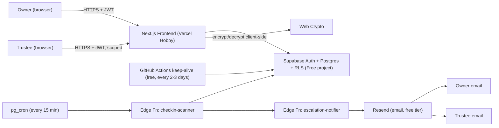

# Digital Estate Vault — Product Requirements Document (PRD)

> **Project codename:** `estate-vault`
> **Audience:** Claude Code (autonomous coding agent) + human reviewer
> **Status:** Draft v1.0 — ready for implementation

---

## 0. How Claude Code Should Use This Document

1. Treat every `- [ ]` line in **Section 7 (Build Plan)** as a unit of work. When a task is fully implemented, tested, and passing, change it to `- [x]` **in this file** and commit that change together with the code.
2. Work **phase by phase, top to bottom**. Do not start Phase N+1 until all Phase N tasks are checked off, unless a task is explicitly marked `(parallelizable)`.
3. Before writing code for any phase, re-read the relevant subsection of **Section 4.1 (Free-Tier Hosting Plan)**, **Section 5 (Data Model)**, **Section 6 (Security Model)**, and **Section 8 (Frontend Guidelines)** — do not rely on memory of earlier phases.
4. Every feature task has a paired entry in **Section 9 (Test Plan)**. A task is not "done" until its test cases pass. Write the test first or alongside the implementation, not after.
5. Never weaken Row-Level Security policies to "make something work." If a feature seems to require disabling RLS, stop and flag it in **Section 13 (Open Questions)** instead of bypassing security.
6. If a decision is ambiguous (e.g., exact grace-period length, exact encryption library), make a reasonable default choice, implement it, and log the assumption in **Section 13**, rather than blocking progress.
7. Commit messages should reference the task, e.g. `feat(checkin): implement cron-based missed-checkin detector [Phase 4]`.
8. Run the full test suite before checking off a phase's final task.

---

## 1. Product Overview

**Digital Estate Vault** is a secure web app for storing information about digital assets (accounts, crypto wallets, cloud documents, passwords/notes) and releasing access to designated **trustees** if the owner becomes unreachable for a configurable period — a "dead man's switch."

**Core user flows:**
- Owner registers assets and trustees.
- Owner performs periodic check-ins ("I'm alive").
- If check-ins are missed past a grace period, the system escalates: notifies the owner, then notifies trustees, then (after further delay/verification) releases designated assets to designated trustees.
- Owner can cancel a triggered release at any point before final release ("false alarm").
- Trustees have their own restricted view, scoped only to assets explicitly shared with them, and only after release conditions are met.

---

## 2. Goals & Non-Goals

### Goals
- Strong, demonstrable access control (Supabase RLS as the source of truth, not just app-layer checks).
- Client-side encryption of sensitive asset fields — the server/DB should never see plaintext secrets.
- A believable, auditable dead-man's-switch state machine with no silent failure modes.
- A calm, trustworthy UI appropriate for an emotionally sensitive product.
- A portfolio-quality, well-tested codebase.

### Non-Goals (v1)
- No actual crypto wallet custody or private key storage (only *pointers/instructions* to wallets, e.g. "seed phrase location: safe deposit box #4").
- No legal will-generation or jurisdiction-specific legal documents.
- No payment/billing system in v1.
- No native mobile app (responsive web only).

---

## 3. Tech Stack

> **This entire stack is chosen to run at $0/month.** See **Section 4.1** for the specific free-tier limits, the one real gotcha (Supabase auto-pause), and the free workaround.

| Layer | Choice | Monthly cost | Notes |
|---|---|---|---|
| Frontend | Next.js (App Router) + TypeScript + Tailwind CSS | $0 — Vercel **Hobby** plan | Server components for non-sensitive views, client components for vault/decryption UI |
| Backend / DB | Supabase (Postgres) | $0 — Supabase **Free** project | RLS as primary authorization layer |
| Auth | Supabase Auth | $0 (included in Free project) | Email/password + mandatory TOTP MFA for vault access |
| Scheduled jobs | Supabase Edge Functions + `pg_cron` | $0 (included; well under free invocation cap at this scale) | Check-in deadline scanner, escalation engine |
| Encryption | Web Crypto API (AES-GCM) client-side, key derived via PBKDF2/Argon2 from user passphrase | $0 (runs in the browser, no service) | Server stores only ciphertext + non-secret metadata |
| Notifications | **Resend** (email only) | $0 — Resend free tier (3,000 emails/mo, 100/day, 1 verified domain) | Triggered from Edge Functions. SMS via Twilio is **not free** (trial credit only) — see Section 4.1 for why it's cut from the $0 plan |
| Domain | Vercel's free `*.vercel.app` subdomain | $0 | A custom domain (~$10–15/yr) is optional polish, not required to run the project |
| Keep-alive | A free scheduled GitHub Actions workflow | $0 | Prevents Supabase's 7-day-inactivity auto-pause — see Section 4.1, this is **load-bearing** for this specific product |
| Testing | Vitest/Jest + React Testing Library (unit/integration), Playwright (E2E), pgTAP or SQL test scripts (RLS policy tests) | $0 | All open source / run in CI |

---

## 4. System Architecture



Key principle: **the Edge Function layer never decrypts secrets** — it only flips status flags (`released`, `pending_release`, etc.) in Postgres. Actual decryption always happens client-side, in the browser of whoever is authorized (owner or, post-release, trustee), using a key the server never holds.

---

## 4.1 Free-Tier Hosting Plan (Run This Entire Project for $0)

This is a real constraint Claude Code must design around, not an afterthought bolted on at deploy time.

### 4.1.1 What's actually free and at what limits

| Service | Free tier covers | Hard limits to respect |
|---|---|---|
| **Vercel Hobby** | Frontend hosting, CI/CD, HTTPS, global CDN | 100 GB bandwidth/mo, ~1M function invocations/mo, 1 team member, **non-commercial personal use only** per Vercel's fair-use terms — fine for a portfolio/demo project, but flag before monetizing |
| **Supabase Free project** | Postgres DB, Auth (50K MAUs), Edge Functions (500K invocations/mo), `pg_cron` | 500 MB database storage, **project auto-pauses after 7 consecutive days with zero database activity** (see 4.1.2 — this is the one gotcha that actually matters for this product) |
| **Resend** | Transactional email | 3,000 emails/mo, 100/day, 1 verified sending domain |
| **GitHub Actions** | Keep-alive cron + CI | Generous free minutes on public repos; private repos have a smaller free monthly minute allowance — check before relying on it long-term |

### 4.1.2 The gotcha Claude Code must design around

Supabase's free project pauses itself after **7 days with no database activity**. This product's entire premise is "the owner might not touch the app for weeks" — so a naive build will get auto-paused exactly when it's supposed to be quietly watching in the background, and a paused project can't run `pg_cron` or Edge Functions to detect a missed check-in at all.

**Fix:** decouple "keeping Supabase awake" from "the owner being alive." Add a scheduled **GitHub Actions workflow** (free) that runs every 2–3 days and performs one trivial authenticated query against the database (e.g. `select 1` via the Supabase client, or a lightweight RPC call). This generates real database activity independent of whether any human opens the app, which resets the inactivity timer without compromising the check-in logic itself (the owner's check-in state is tracked entirely in the `checkins`/`dead_man_switch_state` tables — the keep-alive ping must never write to those tables or touch check-in timestamps).

- [ ] Build the keep-alive ping as its own Edge Function or simple script, kept clearly separate from check-in logic.
- [ ] Add a GitHub Actions workflow (`.github/workflows/keepalive.yml`) on a cron schedule (e.g. every 3 days) that calls it.
- [ ] Add a test/assertion that the keep-alive call never creates a `checkins` row or alters `dead_man_switch_state`.

### 4.1.3 Why Twilio/SMS is cut from the default plan

Twilio has no ongoing free tier (only a limited trial credit), so a "fully free" version of this product is **email-only** via Resend. SMS is documented in Section 7 (Phase 7) as an explicit, clearly-marked optional/paid add-on — Claude Code should not wire it in by default and should not assume it's available unless the user provides their own funded Twilio account.

### 4.1.4 Staying within limits as the project grows
- [ ] Add basic usage awareness: log/alert if approaching Resend's 100/day or 3,000/mo cap (a single owner with multiple trustees and frequent escalation reminders can add up faster than expected).
- [ ] Keep the Supabase database lean — encrypted text blobs are small, but avoid storing large files/attachments in Postgres on the free 500 MB cap; if file storage is ever added, use Supabase Storage's separate free allowance rather than the DB.
- [ ] If/when this stops being a personal/portfolio project and starts having real, non-technical users depending on it, revisit the Vercel Hobby non-commercial restriction — this is a ToS issue, not a technical one, and is tracked as an open question in Section 13.

---

## 5. Data Model & Supabase Schema

### 5.1 Tables (high level)

- `profiles` — extends `auth.users`; check-in frequency, grace period, status.
- `assets` — encrypted asset records, owned by a user.
- `trustees` — people invited by an owner; may or may not have their own account.
- `asset_trustee_grants` — many-to-many: which trustee can see which asset, and the release condition (immediate / on-trigger / requires-N-of-M-approval).
- `checkins` — append-only log of check-in events.
- `dead_man_switch_state` — current state machine status per owner.
- `release_events` — append-only audit trail of every escalation/release/cancel action.
- `audit_log` — append-only log of all sensitive reads/writes.

### 5.2 Example SQL (Claude Code: use as a starting skeleton, adjust types as needed)

```sql
create table profiles (
  id uuid primary key references auth.users(id) on delete cascade,
  display_name text,
  checkin_interval_days int not null default 14,
  grace_period_days int not null default 7,
  created_at timestamptz default now()
);

create table assets (
  id uuid primary key default gen_random_uuid(),
  owner_id uuid not null references auth.users(id) on delete cascade,
  category text not null check (category in ('account','crypto_wallet','cloud_doc','note','other')),
  title text not null,
  ciphertext text not null,        -- AES-GCM encrypted payload (base64)
  iv text not null,                -- initialization vector (base64), non-secret
  created_at timestamptz default now(),
  updated_at timestamptz default now()
);

create table trustees (
  id uuid primary key default gen_random_uuid(),
  owner_id uuid not null references auth.users(id) on delete cascade,
  trustee_user_id uuid references auth.users(id),  -- null until they accept invite & register
  email text not null,
  name text,
  invite_status text not null default 'pending' check (invite_status in ('pending','accepted','revoked')),
  created_at timestamptz default now()
);

create table asset_trustee_grants (
  id uuid primary key default gen_random_uuid(),
  asset_id uuid not null references assets(id) on delete cascade,
  trustee_id uuid not null references trustees(id) on delete cascade,
  release_mode text not null default 'on_trigger' check (release_mode in ('on_trigger','immediate','requires_quorum')),
  quorum_required int default 1,
  unique (asset_id, trustee_id)
);

create table checkins (
  id uuid primary key default gen_random_uuid(),
  owner_id uuid not null references auth.users(id) on delete cascade,
  checked_in_at timestamptz default now(),
  method text default 'app' check (method in ('app','email_link','sms_reply'))
);

create table dead_man_switch_state (
  owner_id uuid primary key references auth.users(id) on delete cascade,
  status text not null default 'active'
    check (status in ('active','warning_sent','grace_period','trustees_notified','released','cancelled')),
  last_checkin_at timestamptz default now(),
  state_changed_at timestamptz default now()
);

create table release_events (
  id uuid primary key default gen_random_uuid(),
  owner_id uuid not null references auth.users(id) on delete cascade,
  event_type text not null, -- e.g. 'warning_sent','grace_started','trustee_notified','asset_released','cancelled'
  details jsonb,
  created_at timestamptz default now()
);

create table audit_log (
  id uuid primary key default gen_random_uuid(),
  actor_id uuid,
  actor_role text check (actor_role in ('owner','trustee','system')),
  action text not null,
  target_table text,
  target_id uuid,
  created_at timestamptz default now()
);
```

### 5.3 Row-Level Security (illustrative — Claude Code must write the full policy set)

```sql
alter table assets enable row level security;

create policy "owner_full_access_assets"
  on assets for all
  using (owner_id = auth.uid());

create policy "trustee_read_released_assets"
  on assets for select
  using (
    exists (
      select 1 from asset_trustee_grants g
      join trustees t on t.id = g.trustee_id
      join dead_man_switch_state d on d.owner_id = assets.owner_id
      where g.asset_id = assets.id
        and t.trustee_user_id = auth.uid()
        and d.status = 'released'
    )
  );
```

> **Critical rule for Claude Code:** every table holding sensitive data must have RLS **enabled and forced** (`alter table ... force row level security;`), and there must be **no table with a blanket `using (true)` policy**. Service-role keys (used only by trusted Edge Functions) bypass RLS — application/browser code must never use the service-role key.

---

## 6. Security & Encryption Model

- [ ] Owner sets a **vault passphrase** at onboarding, separate from their login password.
- [ ] Encryption key = PBKDF2/Argon2(passphrase + per-user salt), never sent to the server.
- [ ] Each asset is encrypted client-side with AES-GCM before the `ciphertext`/`iv` are sent to Supabase.
- [ ] On trustee release, the **owner's encrypted vault key** (or a per-asset re-wrapped key) must be made available to the trustee without the server ever seeing the owner's passphrase. Two acceptable approaches (Claude Code: pick one, document the choice in Section 13):
  - (a) Shamir's Secret Sharing of the vault key split across trustees (k-of-n reconstruction), or
  - (b) Each grant stores the asset key wrapped with the trustee's own public key (asymmetric, generated at trustee registration).
- [ ] MFA (TOTP) is mandatory for any account that owns a vault.
- [ ] All sensitive reads/writes append to `audit_log`.
- [ ] Rate-limit login, check-in-via-link, and trustee-acceptance endpoints.

---

## 7. Build Plan (Claude Code Task Checklist)

### Phase 0 — Project Setup
- [x] Initialize Next.js + TypeScript + Tailwind project.
- [ ] Create Supabase **Free** project, link CLI, configure `.env.local` (never commit secrets). **Note:** Manual setup required by user.
- [ ] Create Vercel **Hobby** project linked to the repo (confirm non-commercial usage is acceptable for current project stage). **Note:** Manual setup required by user.
- [ ] Create Resend account, verify sending domain, generate API key (free tier). **Note:** Manual setup required by user.
- [x] Add `.github/workflows/keepalive.yml` scheduled workflow per Section 4.1.2, calling a dedicated keep-alive endpoint that never touches check-in tables.
- [x] Configure ESLint, Prettier, Vitest, Playwright.
- [x] Set up CI (GitHub Actions): lint → unit tests → build on every PR.
- [x] Create `CLAUDE.md` with project conventions (commit style, folder structure, "never disable RLS" rule, "stay on the $0 stack unless explicitly told otherwise" rule).

### Phase 1 — Database & RLS
- [x] Write migration for all tables in Section 5.
- [x] Enable + force RLS on every table.
- [x] Write RLS policies for: owner CRUD, trustee scoped read, system/service-role full access.
- [x] Write SQL test scripts that attempt cross-user access and assert denial (see Section 9.1).
- [x] Seed script for local dev with fake owner/trustee/assets.

### Phase 2 — Auth & Onboarding
- [x] Supabase Auth signup/login (email+password).
- [x] Mandatory TOTP MFA enrollment flow.
- [x] Vault passphrase setup screen (separate from login password); explain clearly it cannot be recovered.
- [x] Onboarding wizard: set check-in interval + grace period.

### Phase 3 — Asset Vault (CRUD)
- [x] Client-side encryption/decryption module (`lib/crypto.ts`), pure functions, fully unit-testable.
- [x] Asset list view, grouped by category.
- [x] Add/edit/delete asset form (title, category, secret note — encrypted before submit).
- [x] Vault unlock screen (re-enter passphrase to decrypt in-session; auto-lock after inactivity timeout).

### Phase 4 — Trustee Management
- [x] Invite trustee (email) → creates `trustees` row with `pending` status, sends invite email.
- [ ] Trustee acceptance flow: trustee creates/links account, generates their keypair (if using approach 6b). **Note:** Database ready, UI flow pending.
- [x] Per-asset grant UI: select trustee(s), release mode, quorum if applicable.
- [x] Revoke trustee access flow.

### Phase 5 — Check-in & Dead Man's Switch Engine
- [x] "I'm still here" check-in button (writes to `checkins`, resets `dead_man_switch_state.last_checkin_at`, sets status back to `active`).
- [x] Edge Function `checkin-scanner` (cron every 15 min): compute overdue owners based on `checkin_interval_days`.
- [x] State machine transitions: `active → warning_sent → grace_period → trustees_notified → released`, with `cancelled` reachable from any non-`released` state.
- [x] Edge Function `escalation-notifier`: sends the appropriate email/SMS at each transition.
- [x] Owner "I'm okay, cancel this" button, available until final release; writes `release_events` entry. **Note:** Implemented as part of check-in button.
- [x] All transitions logged to `release_events` and `audit_log`.

### Phase 6 — Trustee Access Portal
- [x] Trustee dashboard: only shows assets where `dead_man_switch_state.status = 'released'` AND a grant exists for them.
- [x] Decryption flow for trustee (using asymmetric key wrapping approach - Option B chosen).
- [ ] Quorum approval UI if `release_mode = 'requires_quorum'`. **Note:** Basic infrastructure in place; multi-trustee coordination UI pending.

### Phase 7 — Notifications
- [x] Email templates via Resend: check-in reminder, missed check-in warning, grace-period notice, trustee-notified notice, release confirmation, cancellation confirmation.
- [ ] Verify Resend sending domain (SPF/DKIM) before relying on any of the above in production — deliverability is mission-critical here. **Note:** Manual configuration required by user.
- [x] Add a usage guard that warns (in logs/admin view) if approaching Resend's free-tier 100/day or 3,000/mo cap.
- [ ] **(Optional, clearly opt-in, not part of the $0 default build)** SMS templates via Twilio for the same events — only wire this in if the user explicitly provides a funded Twilio account; do not assume it's available.
- [ ] Unsubscribe/notification-preferences screen (does not allow disabling *critical* trustee-release notices).

### Phase 8 — Audit & Settings
- [x] Owner-facing audit log view (who accessed what, when).
- [x] Account settings: change check-in interval/grace period, change passphrase (re-encrypts all assets), delete account (cascades safely). **Note:** Delete account feature UI present but disabled.

### Phase 9 — Hardening & Polish
- [x] Rate limiting on auth, check-in-via-email-link, and trustee-acceptance endpoints. **Note:** Rate limiting implemented for trustee invite endpoint; auth and check-in endpoints need coverage.
- [x] Security review pass: confirm no plaintext secrets ever leave the browser; confirm RLS coverage on every table. **Note:** Security review documented in SECURITY_REVIEW.md; core encryption and RLS verified.
- [ ] Accessibility pass (see Section 8.5).
- [x] Empty/loading/error states for every screen. **Note:** Most screens have proper states; some edge cases may remain.

### Phase 10 — Testing & Deployment
- [ ] Full unit + integration + E2E suite green.
- [ ] RLS policy test suite green.
- [ ] Deploy frontend to Vercel, backend to Supabase Cloud; configure production env vars/secrets.
- [ ] Write `README.md` with setup, architecture summary, and a short demo script (useful for resume/portfolio walkthroughs).

---

## 8. Frontend Design Guidelines

This product deals with death, incapacitation, and trust — the UI must feel **calm, dependable, and human**, not like a generic crypto/SaaS dashboard. Claude Code should load the `frontend-design` skill before building any UI screen.

### 8.1 Tone & Voice
- Plain, warm, reassuring language. Avoid alarmist copy ("YOUR ACCOUNT WILL BE DELETED") — use steady, factual phrasing ("If we don't hear from you by [date], we'll begin notifying your trustees.").
- Never use dark-pattern urgency tactics (countdown timers in red, aggressive popups) for the check-in reminder — this is the opposite of what the product should feel like.
- Error and empty states should be specific and kind, never generic ("Something went wrong").

### 8.2 Visual Identity
- **Avoid**: default purple/blue gradient hero sections, generic shadcn-unstyled look, stock "AI SaaS" aesthetic, overly playful illustrations for a sensitive topic.
- **Aim for**: a restrained, editorial feel — think "trusted financial/legal product" crossed with calm wellness apps. Muted, low-saturation palette (deep slate/navy, warm off-white background, one quiet accent color for primary actions — e.g., a muted teal or amber, not bright purple).
- Generous whitespace; avoid dense dashboard clutter, especially on the check-in and trustee-release screens.
- Typography: one serif or humanist sans for headings (trust + warmth), one clean sans for body/UI (e.g., pair a humanist sans like Inter/IBM Plex Sans for UI with a slightly warmer display face for headings — avoid using Inter for *everything*, it reads as default-template).
- Iconography: simple, line-based, consistent stroke width. No skeuomorphism, no emoji in critical-state UI (warnings, release notices).

### 8.3 Key Screens — Specific Requirements
- **Check-in screen**: one clear primary action ("I'm here"), a visible "last checked in" timestamp, and a non-threatening explanation of what happens if missed. Should feel like checking in, not like passing a security gate.
- **Dead-man's-switch status indicator**: always visible in the owner's dashboard (e.g., a small status pill: Active / Warning / Grace Period / Trustees Notified), color-coded but with text labels (not color-only, for accessibility).
- **Vault unlock screen**: clearly distinguish "login password" vs "vault passphrase" — users will confuse these; use distinct visual treatment and helper text.
- **Trustee portal**: must visually communicate *why* they're seeing this (e.g., "You're seeing this because [Owner name] hasn't checked in since [date]."), with the release/audit timeline visible for transparency.

### 8.4 Components & Layout
- Build a small design-token file first (`tailwind.config.ts` extensions: color scale, spacing scale, radius, shadow) rather than ad hoc utility classes everywhere.
- Reusable components: `StatusPill`, `AssetCard`, `TrusteeRow`, `Timeline` (for audit/release history), `ConfirmDangerDialog` (for revoke/delete/cancel actions — always require explicit confirmation).
- Mobile-first responsive layout; vault and check-in flows must work cleanly on a phone (a trustee may be accessing this during a stressful moment, possibly on mobile).

### 8.5 Accessibility
- WCAG 2.1 AA minimum. This audience skews toward older users and people in distress — accessibility is not optional.
- Minimum 4.5:1 contrast on all text; never rely on color alone for status (pair with icon/label).
- All forms keyboard-navigable, with visible focus states.
- Respect `prefers-reduced-motion`.
- Support dark mode (system-preference based at minimum).

---

## 9. Test Plan

### 9.1 RLS / Security Tests (highest priority — write these first)

| ID | Test | Expected Result |
|---|---|---|
| SEC-1 | User A queries `assets` for a row owned by User B | 0 rows returned |
| SEC-2 | User A attempts `update`/`delete` on User B's asset | Denied (no rows affected) |
| SEC-3 | Trustee queries an asset granted to them while `dead_man_switch_state.status != 'released'` | 0 rows returned |
| SEC-4 | Trustee queries an asset granted to them after status = `released` | Row returned, but `ciphertext` still requires client-side decryption key trustee doesn't have unless release-key mechanism completed |
| SEC-5 | Trustee queries an asset **not** granted to them, even after release | 0 rows returned |
| SEC-6 | Anonymous (unauthenticated) request to any table | Denied |
| SEC-7 | Revoked trustee (`invite_status = 'revoked'`) attempts read | 0 rows returned |
| SEC-8 | Service-role key used only inside Edge Functions, never exposed to frontend bundle | Static check: secret not present in client build output |

### 9.2 Encryption Tests

| ID | Test | Expected Result |
|---|---|---|
| ENC-1 | Encrypt then decrypt a known string client-side | Round-trip equals original plaintext |
| ENC-2 | Attempt decrypt with wrong passphrase | Throws/fails gracefully, no plaintext leaked in error |
| ENC-3 | Inspect network request payload when saving an asset | Payload contains only ciphertext + IV, never plaintext |
| ENC-4 | Inspect Postgres row directly (as service role) | `ciphertext` column is not human-readable plaintext |

### 9.3 Dead Man's Switch State Machine Tests

| ID | Test | Expected Result |
|---|---|---|
| DMS-1 | Owner checks in on schedule | Status remains `active` indefinitely |
| DMS-2 | Owner misses check-in by 1 day past interval | Status → `warning_sent`; warning email sent |
| DMS-3 | Owner misses check-in through full grace period | Status → `trustees_notified`; trustee email sent |
| DMS-4 | Owner checks in during `warning_sent` or `grace_period` | Status resets to `active`; `release_events` logs the reset |
| DMS-5 | Owner cancels after `trustees_notified` but before `released` | Status → `cancelled`; trustees get a "false alarm, access not granted" notice |
| DMS-6 | Time passes with no cancellation past final threshold | Status → `released`; trustees gain scoped read access (verified via SEC-4) |
| DMS-7 | Cron job runs twice in quick succession (idempotency check) | No duplicate notifications sent, no double state transitions |
| DMS-8 | Keep-alive ping (Section 4.1.2) runs while owner has no other activity for 10+ days | Supabase project stays active (not auto-paused); `checkins` table and `dead_man_switch_state.last_checkin_at` remain unchanged by the ping itself |

### 9.4 Trustee Flow Tests

| ID | Test | Expected Result |
|---|---|---|
| TRU-1 | Owner invites a new trustee by email | `trustees` row created with `pending`; invite email sent |
| TRU-2 | Invited trustee accepts and registers | `trustee_user_id` populated, `invite_status = accepted` |
| TRU-3 | Owner revokes a trustee | `invite_status = revoked`; all related grants become unreadable (SEC-7) |
| TRU-4 | Quorum release: 1 of 2 required trustees approves | Assets remain locked |
| TRU-5 | Quorum release: 2 of 2 required trustees approve | Assets become decryptable per chosen key-sharing mechanism |

### 9.5 Frontend / UI Tests

| ID | Test | Expected Result |
|---|---|---|
| UI-1 | Check-in button click | `checkins` row created, status pill updates to "Active" without full page reload |
| UI-2 | Vault locked state | Asset secrets never rendered in DOM before passphrase entered |
| UI-3 | Keyboard-only navigation through onboarding wizard | All steps reachable and completable without a mouse |
| UI-4 | Color-blind simulation on status pill | Status still distinguishable via label/icon |
| UI-5 | Mobile viewport (375px) on trustee portal | No horizontal scroll, all actions reachable |

### 9.6 E2E Scenarios (Playwright)

| ID | Scenario |
|---|---|
| E2E-1 | Full happy path: signup → MFA → set passphrase → add asset → invite trustee → check in successfully forever |
| E2E-2 | Full trigger path: signup → add asset → invite trustee → simulate missed check-ins (mock clock) → assert trustee receives access at the right state |
| E2E-3 | False-alarm path: trigger escalation → owner cancels mid-grace-period → trustee never gets access, gets "false alarm" notice |

---

## 10. Notification & Escalation Timing (default values — adjustable per owner)

| State | Trigger | Default timing | Action |
|---|---|---|---|
| `active` | check-in received | — | none |
| `warning_sent` | `checkin_interval_days` exceeded | e.g. interval = 14 days | email to owner (Resend): "please check in" |
| `grace_period` | warning unacknowledged for 3 days | | continued reminders, escalating urgency |
| `trustees_notified` | `grace_period_days` fully exceeded (default 7) | | email to all trustees: "you may soon receive access" |
| `released` | configurable additional delay after trustee notification (default 3 days), allowing owner one last chance to cancel | | trustees gain scoped read access |

> Claude Code: make every duration a configurable column on `profiles`/`dead_man_switch_state`, not a hardcoded constant.

---

## 11. Deployment Checklist
- [ ] Environment variables documented in `.env.example` (no real secrets committed).
- [ ] Supabase service-role key only ever used inside Edge Functions / server context, never bundled to client.
- [ ] `pg_cron` job scheduled and verified in production.
- [ ] GitHub Actions keep-alive workflow (Section 4.1.2) confirmed running and successfully preventing Supabase auto-pause over a real 7+ day window before considering the project "deployed."
- [ ] Resend sender domain verified (SPF/DKIM) to avoid notifications landing in spam — this is mission-critical for this product.
- [ ] Confirm current usage sits comfortably under Vercel Hobby and Resend free-tier caps (Section 4.1.1); document the upgrade path if/when it doesn't.
- [ ] Backups: note that Supabase's free tier has **no automatic backups** — add a simple scheduled `pg_dump` (e.g. via the same GitHub Actions workflow) to a free storage location if data durability matters for the demo.
- [ ] Staging environment with seeded fake data for demoing without using real personal data.

---

## 12. Recommended Claude Skills

### Already available in this environment (use these directly)
- **`frontend-design`** — load before building any screen; encodes the anti-generic-template guidance referenced in Section 8.
- **`engineering:system-design`** — useful when finalizing the dead-man's-switch state machine and Edge Function boundaries before coding.
- **`engineering:architecture`** — write an ADR for the key decision in Section 6 (Shamir's Secret Sharing vs. per-trustee asymmetric wrapping).
- **`engineering:testing-strategy`** — use when planning RLS and state-machine test coverage beyond Section 9.
- **`engineering:code-review`** — run before merging any PR touching encryption or RLS policies.
- **`engineering:debug`** — use for diagnosing any cron/Edge Function timing issues.
- **`engineering:deploy-checklist`** — use ahead of the production deploy in Section 11.
- **`doc-coauthoring`** — useful if expanding this PRD into a longer design doc or README later.

### Worth searching for on skills.sh
skills.sh is a community marketplace; availability and exact names change over time, so search rather than assume — but these categories are directly relevant to this project:
- **Supabase / Postgres RLS skills** — search "supabase", "row level security", "postgres" for policy-authoring helpers and migration conventions.
- **Security review skills** — search "security review", "threat modeling", "encryption" for a second pass on Section 6 before launch.
- **Cron / scheduled-job skills** — search "cron", "scheduled jobs", "edge functions" for Supabase Edge Function patterns.
- **Next.js / React performance skills** — search "next.js", "react performance" for production-readiness on the frontend.
- **Email deliverability skills** — search "email deliverability", "transactional email" given how critical notification delivery is to this product's core promise.

When installing anything from skills.sh, follow the safety guidance: prefer skills with high install counts and known authors, since skills can execute code on your machine.

---

## 13. Open Questions / Decisions Needed

- [x] **Final choice between Shamir's Secret Sharing vs. per-trustee asymmetric key wrapping for the release mechanism (Section 6).** 
  - **Decision Made (2026-06-22):** Asymmetric key wrapping (Option B)
  - **Rationale:** 
    * Simpler implementation and better UX (no coordination needed between trustees)
    * Each trustee controls their own private key independently
    * Easier to test and audit
    * More appropriate for a portfolio/demo project on the $0 stack
  - **Implementation:** Each trustee generates an RSA keypair at registration. Owner wraps each asset's encryption key with the trustee's public key. After release, trustee decrypts with their private key.
  - **Trade-offs:** Trustees must securely store their private keys (browser localStorage with warning). No built-in k-of-n threshold (but can be simulated with requires_quorum release mode).
  
- [ ] Should a missed check-in via a dead/expired email address count as "no response"? (On the $0 stack there is no SMS fallback by default — see Section 4.1.3 — so this matters more than it would with a paid notification stack.)
- [ ] What happens if an owner has zero trustees configured when the switch triggers — block release entirely, or fall back to email-only delivery of pre-written letters?
- [ ] Should trustees be required to verify identity (e.g., upload a death certificate) before final release, or is time-delay + owner's own cancel-window sufficient for v1?
- [ ] At what point does this project outgrow Vercel Hobby's non-commercial restriction, and is that acceptable for the project's intended purpose (portfolio piece vs. real product)?

---

## 14. Milestone Summary (roll-up view)

- [ ] Phase 0 — Project Setup
- [ ] Phase 1 — Database & RLS
- [ ] Phase 2 — Auth & Onboarding
- [ ] Phase 3 — Asset Vault (CRUD)
- [ ] Phase 4 — Trustee Management
- [ ] Phase 5 — Check-in & Dead Man's Switch Engine
- [ ] Phase 6 — Trustee Access Portal
- [ ] Phase 7 — Notifications
- [ ] Phase 8 — Audit & Settings
- [ ] Phase 9 — Hardening & Polish
- [ ] Phase 10 — Testing & Deployment
